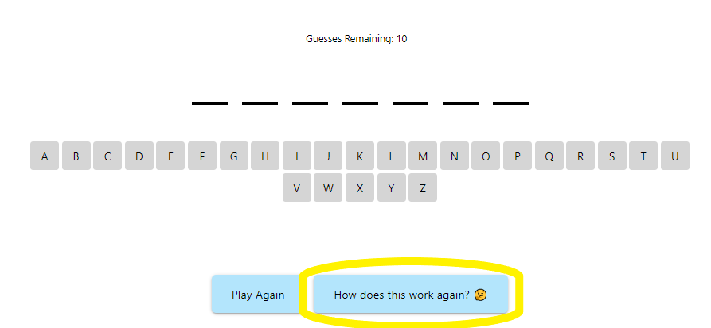

# NaNarWord - Word Guessing Game
​
## Table of contents
​
- [Overview](#overview)
 - [The Game](#the-game)
 - [Features](#features)
 - [Gameplay Gif](#gameplay-gif)
 - [Links](#links)
- [Behind the Code](#behind-the-code)
 - [Built with](#built-with)
 - [APIs](#apis)
 - [Continued development](#continued-development)
 - [Useful resources](#useful-resources)
- [Authors](#authors)
- [Acknowledgments](#acknowledgments)
​
​
## Overview
​
### The Game
​
Welcome to NaNarWord!  This mobile friendly web app provides an immersive experience into the world of words.  After choosing a level, the player is challenged to guess a randomly selected word, provided by Wordnik API, with a limited number of guesses.  Upon winning or losing, a fun surprise appears on screen; this includes academic information about that word, as well as audio of pronunciation if available, and a reward GIF.  The player's top 10 previously solved words are kept in a word bank sorted by most rarely used first.  If they want to see the corpus frequency and information about that word, they can click it for an informational modal.
 
Ease into gameplay by selecting "common words", challenge yourself by choosing the "not so common words" category, and delve into the fringes of word society by playing the "WTF does that mean?" category.  The experience is fun, and educational!
 
Play [here](https://nanifer.github.io/NaNarWord-word-game/).
​
### Features
​
NaNarWord is loaded with little features to enhance user experience.  Here are a few to note so you don't miss out:
 
##### Sound
If you're the type that enjoys a more immersive experience, yes our app has sound!  On page load the game will not play any of the sound effects, so be sure to click on the sound button to toggle sound on/off located in the top right of the screen if you want to add a touch of joy. Below is an image of what it looks like:
 

 
##### Pronunciation and Definition
The webapp provides information after completing gameplay about the last played word.  Also, a "word bank" is displayed for the user's top rarest previously played words.  Be sure to checkout the information; most words are accompanied by Merriam Webster's short definition and a pronunciation audio player.  If data is not available from Merriam Webster, checkout the URL for Wordnik's entry of that word on their website is provided for more information.  In addition, the "word bank" is interactive and will display an informational modal for any word you click.  The information provided is the same type as the end of game information.  Below is an example of a modal provided by clicking a "word bank" word:
 

 
##### Help Modal
If the player finds themselves lost during gameplay, there is an informational help modal available.  Just access it by clicking the "How does this work again?" button below the gameplay area.  It looks like this:
 

 
​
### Gameplay Gif
​**Nolan will add a gif of our gameplay once final version of the site is ready**

​
Add a screenshot of your solution. The easiest way to do this is to use Firefox to view your project, right-click the page and select "Take a Screenshot". You can choose either a full-height screenshot or a cropped one based on how long the page is. If it's very long, it might be best to crop it.
​
Alternatively, you can use a tool like [FireShot](https://getfireshot.com/) to take the screenshot. FireShot has a free option, so you don't need to purchase it.
​
Then crop/optimize/edit your image however you like, add it to your project, and update the file path in the image above.
​
**Note: Delete this note and the paragraphs above when you add your screenshot. If you prefer not to add a screenshot, feel free to remove this entire section.**
​
### Links
​
Here is the deployed web app, check it out!
- Live Site URL: [https://nanifer.github.io/NaNarWord-word-game/](https://nanifer.github.io/NaNarWord-word-game/)
​
## Behind the Code
​
### Built with
​
- Semantic HTML5 markup
- CSS
- JavaScript
- Materialize CSS framework
​
​
### APIs
​
The NaNarWord game employs three different APIs to deliver the best gameplay to the player.  In the [resources](#useful-resources) section of this readme, there are links for all APIs used in this web app.  Following is some information on those three APIs: Wordnik API, Merriam Webster API, and Giphy API.
 
##### Wordnik
[Wordnik](https://www.wordnik.com/) is a non-profit organization striving to provide access to information on every English word to everyone on this planet.  Their data is extensive and powerful in the sense that they have built a corpus of word data that is very large.  The reason the project team used Wordnik to provide the random words is because we could provide very obscure and "non-proper" words for our "WTF does that mean?" category.  Merriam Webster will only provide official words that they have in their dictionary.
 
Wordnik provided us a query parameter for "corpus frequency" to filter random words by how many occurrences that word has in their corpus of data.  This provided an interesting way to present players words based on commonality.  Also, when Merriam Webster doesn't have an entry for one of these non-official obscure words, the user is presented with Worknik's URL entry for that word.  There, one can find information on what part of their corpus the word appears and alternative definition sources.
 
##### Merriam Webster
The project team wanted an official provider of word definitions for the words played.  We chose [Merriam Webster's Dictionary API](https://dictionaryapi.com/) because they are a recognizable and respected source.  When they don't have a defintion for obscure words, the code would provide Wordnik data instead.  In order to access the Merriam Webster audio files, the URL parameters would have to be conditionally built using data provided in the fetch request.  Below is a block of code that can be used to appropriately build the correct URL; all it needs is the Merriam Webster API data as a parameter.  There is a case to check that entry has a proununciation key; next it will check if the pronounciation key has audio data.  If it does, the code will build the URL as directed by the API docs and return an `<audio>` element with the correct src value; if not, it will return a `<p>` element to notify the use that no audio is available for that word.  This code block can be repurposed to quickly build sound URLs from Merriam Webster API data objects.
```js
function merriamSound(data) {
   // check if pronunciation entry exists
   if ("prs" in data[0].hwi) {
       let audio = data[0].hwi.prs[0].sound.audio;
       // if audio doesn't exist then return element with no audio statement
       if (!audio) {
           let audioMerriam = document.createElement("p");
           audioMerriam.textContent = "There is no audio file from Merriam Webster API for this word.";
           return audioMerriam;
       }
       // Define the subdirectory parameter using Merriam's API documentation instructions
       let subDir;
       if ((/[\d!"#$%&'()*+,-./:;<=>?@[\]^_`{|}~]/g).test(audio.charAt(0))) {
           subDir = 'number';
       }
       if (audio.charAt(0) === 'g' && audio.charAt(1) === 'g') {
           subDir = 'gg';
       }
       if (audio.charAt(0) === 'b' && audio.charAt(1) === 'i' && audio.charAt(2) === 'x') {
           subDir = 'bix'
       }
       else {
           subDir = audio[0];
       }
       // Return the url for the src attribute of an audio element
       let audioUrl = `https://media.merriam-webster.com/audio/prons/en/us/mp3/${subDir}/${audio}.mp3`;
       let audioMerriam = document.createElement("audio");
       audioMerriam.src = audioUrl;
       audioMerriam.controls = true;
       return audioMerriam;
   }
   else {
       let audioMerriam = document.createElement("p");
       audioMerriam.textContent = "There is no audio file from Merriam Webster API for this word.";
       return audioMerriam;
   }
}
```
​##### Displaying the WordBank Modal
Our team saved all of the dynamically displayed content into a vairable called defArray, which grabs its data from the grabWordDef function. The saved array allowed us to use the information both in the endGame function, as well as the WordBank Modal once one of the word buttons are clicked. Here is an example of how easy it made it to append in the modal:

```js
// Calls on definition and displays modal
async function retrieveDefinition(buttonEl, wordList) {
    let appendDefEl = document.getElementById("append-definition");
    // Empties div here
    if (appendDefEl.hasChildNodes()) {
        appendDefEl.innerHTML = "";
    }
    let recallFreqEl = document.createElement("p");
    let recallWord = buttonEl.dataset.word;
    recallFreqEl.innerText = `Corpus Frequency: ${buttonEl.dataset.frequency}`;
    let defArray = await grabWordDef(recallWord);
    // Merriam
    if (defArray[0] === true) {
        appendDefEl.append(
            defArray[1],
            defArray[2],
            defArray[3],
            defArray[4],
            recallFreqEl,
            defArray[6],
            defArray[7]
        );

    }
    // If it is the Wordnik Source URL
    else {
        appendDefEl.append(
            defArray[1],
            defArray[2],
            defArray[3],
            recallFreqEl,
            defArray[5]
        );
    }
}
``` 
​
**Everyone Add anything you find interesting for employers or fellow coders**
​
### Continued development
​
NaNarWord is in it's infancy currently.  The team is proud of what was accomplished in the first version deployment but also look forward to future development.  We not only want to refine the app's UI/UX but also add new features to further engage the user.
 
As of now, the information utilized from Merriam Webster API is just scratching the surface of what is available.  Merriam Webster API has very complex data structures returned in fetch requests that need to be read on a case by case.  In the future we would like to provide much richer word information for solved words instead of one abbreviated shortdefinition that is currently provided.  More research must be done to properly read and utilize Merriam Webster's complicated data structure return.
 
Also, a new feature that we definitely want to implement is word categories.  It would be fun for the user to be able to select word categories for gameplay instead of truly random words.  Wordnik API has some parameters providing related words but aren't quite extensive enough data structures to give players enough words to play through.  There is definitely a solution to this problem that can be worked through in the future to implement this feature.
 
**Anyone add addition continued development here**
​
### Useful resources
​
- [Wordnik](https://www.wordnik.com/) - This is the website for the non-profit group that built the Wordnik API utilized in this project.
- [Wordnik API](https://developer.wordnik.com/) - This is the developer site for Wordnik API which we used for random words and their word information.  Very ease to follow documentation to start using their API.
- [Merriam Webster Dictionary API](https://dictionaryapi.com/) - This is the website for Merriam Webster's API which contains the documentation on how to use it.
- [Giphy API](https://developers.giphy.com/) - This is the website for Gihpy's API and has the documentation on how to use it.
 
​
## Authors
 
### Nifer Kilakila
- GitHub - [NaNifer](https://github.com/NaNifer)
- Portfolio - [Nifer Kilakila](https://nanifer.github.io/Nifer-Kilakila-Portfolio-h2/)
### Angie Soto​
**Angie add here**
### Ivy Chang
**Ivy add here**
### Nolan Spence
- Website - [Nolan Spence](https://unicorn-barf.github.io/Portfolio_Website_HTML_CSS/)
- Github - [Unicorn-Barf](https://github.com/Unicorn-Barf)
​
​
## Acknowledgments
​
### From Nolan
I want to give a special thank you to Wordnik for being available for questions as well as for providing a very cool API to work with.  Specifically Erin McKean, thank you for responding so quickly to emails!  Their mission is to provide access to English word information to anyone everywhere on our home Earth.  Also, thank you to my team for persevering through this project enthusiastically.  It wasn't easy but you all made it a fun experience!

### From Nifer
Huge shout out to [nullaus](https://github.com/nullaus) who was my quick dial on JS questions, and helped our team navigate git using repositories and conflicts. And of course, it has been a pleasure to work with this great team of people. Everyone is very collaborative, flexible, dedicated, and posses a refined growth-mindset. The process has been fun and intellectually stimulating!

 
**Everyone add any thank you's!!**